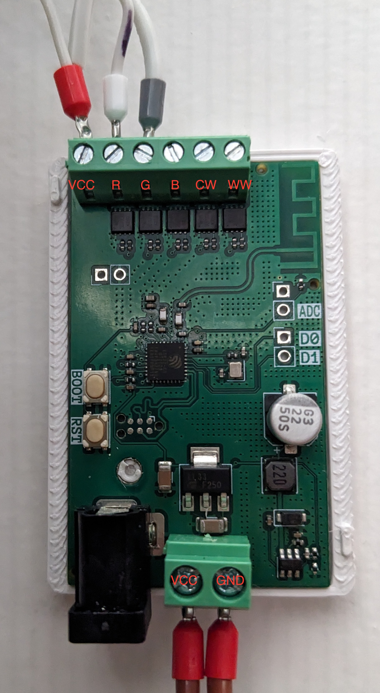
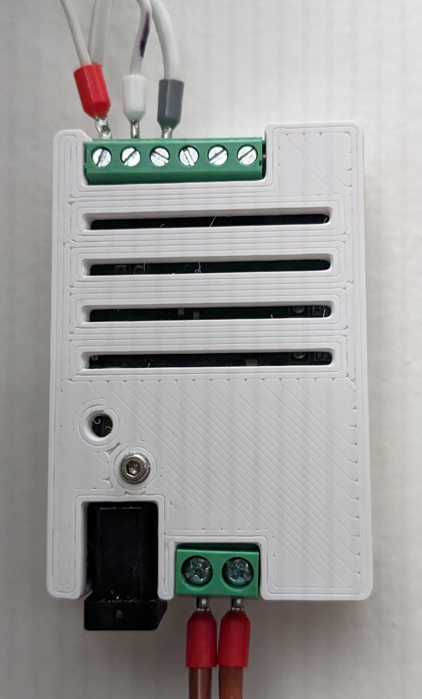

# esp32-rgbww
This is a custom ESP32-based LED controller that easily links with
ESPhome and Home Assistant.

The device has 5 low-side MOSFETs for controlling LEDs up to 24V. Terminal block
rated for 8A of current, barrel jack rated for 6A. Device must be flashed
using a Tag-Connect TC2030-USB-NL cable. Two config files are available.

## PCB and Pinout

### GPIO Pin Index

| Labeled Pin | GPIO Pin |
| ----------- | -------- |
| R           | 10       |
| G           | 7        |
| B           | 6        |
| CW          | 5        |
| WW          | 3        |
| D0          | 28       |
| D1          | 27       |
| ADC         | 4        |

## 3D Printed Case

3D Printable parts are available in the STL directory. These parts should be
printed from a plastic capable of withstanding 70C internal temperatures (ABS
recommended). An M2 bolt can be used to secure the case together, however care
should be used as the female end is vulnerable to cracking.

## Configuration

### 2channel-monochrome.yaml
Provides 2 independent channels of monochrome LED support (trivially extendable
to 5).

### rgbww.yaml
Provides 5 channels of LED support, intended for 6 wire LED strips (RGB, CW,
WW).

Exposed to ESPhome/Home Assistant as a RGBWW light with color interlock
enabled.

## Future Work
1. The case's screw hole can crack if over-torqued, or if the print is of low
quality. A future revision should allow for a larger female end to avoid cracks
and layer separation while screwing the case halves together.
2. The PWM frequency can cause visible artifacts on rolling shutter cameras. 
Experiment with the PWM frequency and capacitors to reduce these artifacts
3. Due to gate capacitance, the LEDs can take up two seconds to respond to
"turn off" signals. Use a proper gate driver circuit for the MOSFETs
